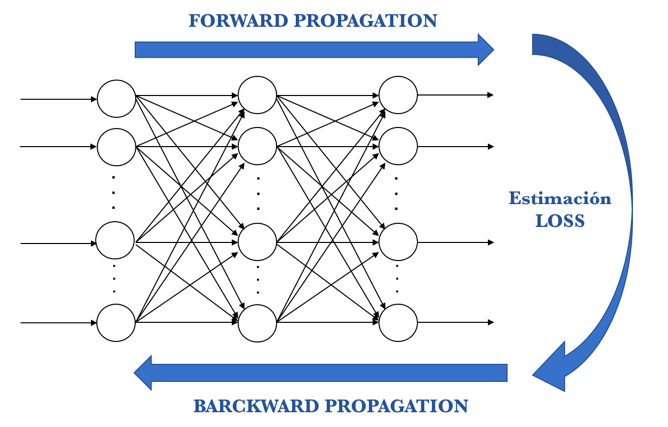

# Introducción
Una de las ramas más importantes del Machine Learning y la Inteligencia Artificial son las redes neuronales. Las redes neuronales (neural networks) son una representación abstracta del comportamiento de una red neuronal biológica. Su contexto se remonta a 1943, año en el cual McCulloch y Pitts proponen el primer modelo neuronal, dicho modelo era un modelo binario, en el cual cada neurona tenía un escalón o umbral prefijado. De esta manera sirvió de base para los modelos posteriores.

# Redes Neuronales

### Conceptos

Al igual que una neurona biológica, una neurona artificial trata de imitar el comportamiento y funcionamiento de las neuronas de los organismos vivos. Se encuentra compuesta por distintas capas y es posible agrupar multiples neuronas para en conjunto formar una red neuronal que permita formar una red neuronal, conectadas entre si y de forma que se puedan transmitir señales para lograr realizar calculos mas complejos. De esta forma damos paso a la estructura y cada una de sus componentes.


# Estructura

### Capas

Las redes neuronales están compuestas por capas de neuronas que se comunican entre si y es posible dividirlas de la siguiente manera:

- **Capa de entrada:** Contiene todas nuestras entradas o datos de entrenamiento, estos contarán con pesos que permitirán expresar su importancia.

- **Capa oculta:** La capa oculta puede estar conformada por una o varias capas, el número de capas dependerá de qué tan sofisticado queremos nuestro modelo. Sin embargo, es necesario recalcar que mientras más capas se tengan necesitaremos más recursos como tiempo y poder computacional.

- **Capa de salida:** Se encarga de entregar los resultados, puede contar con una o varias neuronas, dependerá del número de características que se desean llegar a encontrar.


### Entradas, pesos, suma ponderada y salida

+ **Entradas $(x_{j})$:** Las entradas reciben los datos de otras neuronas.

- **Pesos sinápticos $(w_{ij})$:** Se hace una asignación de pesos pequeños generados de forma aleatoria, en un rango de valores entre $-0.5$ y $0.5$ o algo similar.

+ **Función base:** Es una función que corresponde a una combinación lineal del conjunto de entradas y los pesos sinápticos. Es decir:

$$u_{i}(w,x)=\sum_{j=1}^{n}w_{ij}x_{j}$$

### Sesgo

Ayuda a mover la línea que divide los datos de cada neurona, si el valor de $b$ es cero, la línea pasa por el origen, dependiendo del número que tenga este parámetro es por donde pasará la línea que divide a los datos.

$$u_{i}(w,x)=\sum_{j=1}^{n}w_{ij}x_{j} \longrightarrow z=b+\sum_{j=1}^{n}w_{ij}x_{j} $$

### Pesos

De acuerdo a su estructura las redes neuronales se clasifican en:

+ **Redes monocapa:** Compuestas por una única capa de neuronas.

- **Redes multicapa:** Las neuronas se organizan en varias capas.

<center>
{width=500px}

### Función de activación

Las funciones de activación se dividen en dos tipos como: lineal y no lineal

# Aprendizaje automático
El aprendizaje automatico en las redes neuronales consta de unos pasos iniciales a los que se expone esta, para generar por medio del entrenamiento un primer acercamiento a las estimaciones que se pretenden realizar y en los cuales lo ideal es detectar cambios entre el valor estimado y el valor esperado para realizar los ajustes a las distintas combinaciones de los pesos.

### ForwardPropagation
Se expone la red a los datos de entrenamiento y estos cruzan toda la red neuronal para ser calculadas sus predicciones (labels). Es decir, pasar los datos de entrada a través de la red de tal manera que todas las neuronas apliquen su transformación a la información que reciben de las neuronas de la capa anterior y la envíen a las neuronas de la capa siguiente. Cuando los datos hayan cruzado todas las capas, y todas sus neuronas han realizado sus cálculos, se llegará a la capa final con un resultado de predicción de la label para aquellos ejemplos de entrada. 

### Función Loss
Se usa para estimar el error, para comparar y medir qué tan bueno/malo fue el resultado de la predicción en relación con el resultado correcto. Idealmente, queremos que nuestro coste sea cero, es decir, sin divergencia entre valor estimado y el esperado. Por eso a medida que se entrena el modelo se irán ajustando los pesos de las interconexiones de las neuronas de manera automática hasta obtener buenas predicciones.

### Backpropagation
Partiendo de la capa de salida, esa información de loss se propaga hacia todas las neuronas de la capa oculta que contribuyen directamente a la salida. Sin embargo las neuronas de la capa oculta solo reciben una fracción de la señal total de la loss, basándose aproximadamente en la contribución relativa que haya aportado cada neurona a la salida original.

<center>
{width=500px}


# Problemas en las redes neuronales

**Valores iniciales:** Hace referencia a los valores que los pesos iniciales pueden tomar. Así, es recomendable llevar acabo una asignación de pesos pequeños generados de forma aleatoria.

**Sobreajuste:** También denominado "overfitting", se produce cuando un sistema de aprendizaje automático se entrena demasiado o con datos anómalos, que hace que el algoritmo aprenda patrones que no son generales.

**Escalado de las entradas:** Es recomendable estandarizar todas las entradas para que tengan una media de cero y una desviación estándar de uno.

**Capas y unidades ocultas:** El número de unidades ocultas está directamente relacionado con las capacidades de la red. En general, es mejor tener demasiadas unidades ocultas que muy pocas.

# Ejemplo de aplicación

Se hará uso del conjunto de datos denominado: "Boston" perteneciente al paquete MASS. El conjunto de datos de Boston es una colección de datos sobre el valor de las viviendas en los suburbios de Boston. Nuestro objetivo es predecir el valor medio de las viviendas ocupadas por sus propietarios (medv) utilizando todas las demás variables continuas disponibles, esto mediante un modelo de regresión y una red neuronal.

## Adaptación de la red neuronal 

Antes de instalar una red neuronal, es necesario realizar algunos preparativos. Como primer paso, se aborda el preprocesamiento de datos. Aquí se normalizan los datos antes de entrenar la red neuronal.

Se elige el método min-max y se escalan los datos en el intervalo [0,1]. Normalmente, el escalado en los intervalos [0,1] o [-1,1] tiende a dar mejores resultados. Por lo tanto, escalamos y dividimos los datos antes de continuar:

```{r warning=FALSE, include=T, paged.print=TRUE}
set.seed(500)
suppressMessages(library(MASS))
suppressMessages(library(neuralnet))
data <- Boston # Este set de datos pertenece 
               # a la librerías MASS, es un conjunto de datos de pruebas que ésta posee
```

```{r warning=FALSE, include=T, paged.print=F}
index <- sample(1:nrow(data),round(0.75*nrow(data)))# se toma una muestra aleatoria
train <- data[index,] # función de entrenamiento
test <- data[-index,] # función de prueba
lm.fit <- glm(medv~., data=train)
pr.lm <- predict(lm.fit,test)
MSE.lm <- sum((pr.lm - test$medv)^2)/nrow(test)
```

```{r warning=FALSE, include=T, paged.print=TRUE}
maxs <- apply(data, 2, max) #valores máximos para el entrenamiento
mins <- apply(data, 2, min) #valores mínimos para el entrenamiento
scaled <- as.data.frame(scale(data, center = mins, scale = maxs - mins))
train_ <- scaled[index,]
test_ <- scaled[-index,]
```

## Parámetros

En esta ocasión, vamos a utilizar 2 capas ocultas con esta configuración:

$$13:5:3:1$$

La capa de entrada tiene 13 entradas, las dos capas ocultas tienen 5 y 3 neuronas y la capa de salida tiene, por supuesto, una única salida ya que estamos haciendo regresión.

```{r warning=FALSE, include=T, paged.print=TRUE}
n <- names(train_)
f <- as.formula(paste("medv ~", paste(n[!n %in% "medv"], collapse = " + ")))
nn <- neuralnet(f,data=train_,hidden=c(5,3),linear.output=T)
```

De esta manera, la representación gráfica del modelo con los pesos en cada conexión es la siguiente:

<center>
{width=700px}


A partir de la figura anterior es posible identificar:

+ Las líneas negras muestran las conexiones entre cada capa y los pesos en cada conexión.

- Las líneas azules muestran el término de sesgo agregado en cada paso.

+ El sesgo se puede pensar como la intersección de un modelo lineal.

- Finalmente, el algoritmo de entrenamiento ha convergido y, por lo tanto, el modelo está listo para ser utilizado.

Posteriormente se realiza una comparación visual del ajuste de las estimaciones mediante la red neuronal y el modelo de regresión. 

<center>
{width=300px}

A partir de la figura anterior es posible evidenciar que las predicciones hechas por la red neuronal se encuentran más concentradas alrededor de la línea, evidenciando una mejor predicción a la realizada mediante el modelo lineal de forma tradicional.

```{r warning=FALSE, include=F, paged.print=TRUE}
pr.nn <- compute(nn,test_[,1:13])

pr.nn_ <- pr.nn$net.result*(max(data$medv)-min(data$medv))+min(data$medv)
test.r <- (test_$medv)*(max(data$medv)-min(data$medv))+min(data$medv)

MSE.nn <- sum((test.r - pr.nn_)^2)/nrow(test_)
```

```{r warning=FALSE, include=T, paged.print=TRUE}
print(paste(MSE.lm,MSE.nn))
```

Adicional a la figura , se cuenta también con el error cuadrático medio (MSE) de 14.097 para las estimaciones obtenidas mediante la red neuronal, esto en comparación al 20.77 entregado por el modelo lineal. Lo cual permite concluir que la red neuronal entrega mejores estimaciones del precio medio de las viviendas esto en comparación con el modelo lineal. 


# Bibliografía

+ Hastie, T., Tibshirani, R., & Friedman, J. (2009). The elements of statistical learning: data mining, inference, and prediction. Springer Science & Business Media.

- Efron, B., & Hastie, T. (2016). Computer age statistical inference (Vol. 5). Cambridge University Press.

