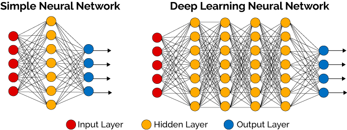
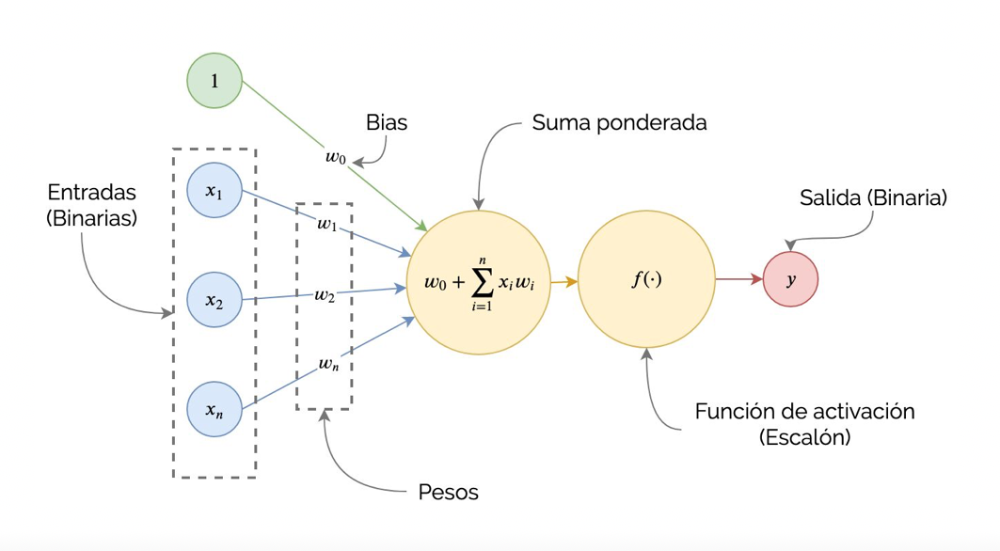
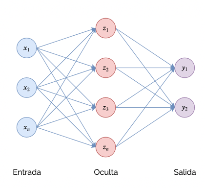
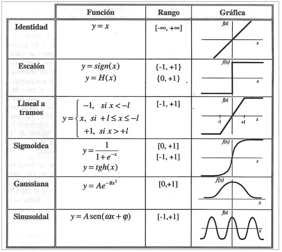
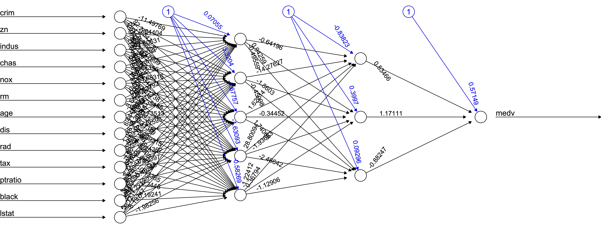
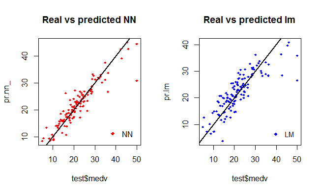
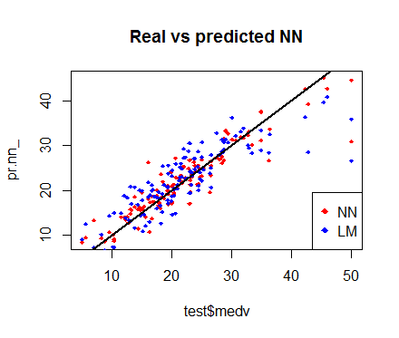

## Introducción
<div style="text-align: justify">

Las redes neuronales (neural networks) se enmarcan dentro del campo de la Inteligencia Artificial.

Las redes neuronales artificiales son una representación abstracta del comportamiento de una red neuronal biológica. Su contexto se remonta a 1943, año en el cual McCulloch y Pitts proponen el primer modelo neuronal, dicho modelo era un modelo binario, en el cual cada neurona tenía un escalón o umbral prefijado. De esta manera sirvió de base para los modelos posteriores.

<center>
{width=500px}
<div>

## Red neuronal

<div style="text-align: justify">

Las neuronas son simples procesadores de información, consisten en un cuerpo celular y cables que los conectan entre si.Sus partes son:

+ **Dendritas:** Constituyen el canal de entrada de la información.
- **Cuerpo celular (Soma):** Es el órgano de cómputo.
+ **Axón:** Corresponde al canal de salida.
- **Sinapsis**

<div class="columns-2">

<center>
{height=300px}
<center>
{height=250px}

<div class="columns-2">

<div>

## Redes neuronales

<div style="text-align: justify">
<center>
{height=250px}

## Estructura

<center>
{height=400px}

## Estructura

<div style="text-align: justify">

+ **Entradas $(x_{i})$:**

- **Pesos sinapticos $(w_{ij})$:** Se hace una asignación de pesos pequeños generados de forma aleatoria, en un rango de valores entre $-0.5$ y $0.5$ o algo similar

+ **Bias $(b)$:** Ayuda a mover la línea que divide los datos de cada neurona, si el valor de $b$ es cero, la línea pasa por el origen, dependiendo del numero que tenga este paremetro es por donde pasara la línea que divide a los datos.

+ **Función base:** Es una función que corresponde a una combinación lineal de las entradas.

$$u_{i}(w,x)=\sum_{j=1}^{n}w_{ij}x_{j} \longrightarrow z=b+\sum_{j=1}^{n}w_{ij}x_{j} $$


- **Función de activación $(\sigma(z))$:**

+

<div>

## Estructura

<center>
{height=400px}

## Capas
<div style="text-align: justify">
Las redes neuronales están compuestas por capas de neuronas que se comunican entre si y es posible dividirlas de la siguiente manera:

<div class="columns-2">

- **Capa de entrada:** Contiene todas nuestras entradas o datos de entrenamiento, estos contarán con pesos que permitirán expresar su importancia.

- **Capa oculta:** Puede estar conformada a su vez por una o varias capas, el número de capas dependerá de qué tan sofisticado queremos nuestro modelo. Sin embargo, es necesario recalcar que mientras más capas se tengan necesitaremos más recursos como tiempo y poder computacional.

- **Capa de salida:** Se encarga de entregar los resultados, puede contar con una o varias neuronas, dependerá del número de características que se desean llegar a encontrar.

<div>

<center>
{width=400px}
<div class="columns-2">

## Función de activación
<div style="text-align: justify">

**Nota:** Se debe considerar que en la red neuronal se usará una función no lineal debido a que le permite al modelo adaptarse para trabajar con la mayor cantidad de datos.

Las funciones de activación se dividen en dos tipos como: lineal y no lineal

<div class="columns-2">

+ **Función lineal**

- **Funciones no lineales:**

    + Sigmoide
    
    - Umbral
    
    + Tangente hiperbólica
    
    - ReLu
    
    + Softmax
    

<center>
{width=400px}

<div class="columns-2">

# Aprendizaje automático

<div style="text-align: justify">

## **Algoritmo Backpropagation**

1. Asignamos a cada conexión neuronal un peso con un valor pequeño, pero no nulo.

2. Introducimos la primera observación de nuestro conjunto de entrenamiento por la capa inicial de la red neuronal.

3. La información se propaga de izquierda a derecha, activando cada neurona que ahora es afectada por el peso de cada conexión, hasta llegar a la capa de neuronas de salida, obteniendo el resultado final para esa observación en concreto.

4. Medimos el error que hemos cometido para esa observación.

5. Comienza la propagación hacia atrás de derecha a izquierda, actualizando los pesos de cada conexión neuronal, dependiendo de la responsabilidad del peso actualizado en el error cometido.

6. Repetimos los pasos desde el paso 2, actualizando todos los pesos para cada observación o conjunto de observaciones de nuestro conjunto de entrenamiento.

7. Cuando todas las observaciones del conjunto de entrenamiento ha pasado por la red neuronal, hemos completado lo que se denomina un Epoch. Podemos realizar tantos Epochs como creamos convenientes.

<div/>

# Algunos problemas en el entrenamiento de las redes neuronales
##
<div style="text-align: justify">

+ **Valores iniciales:** Se hace referencia a los valores que los pesos iniciales pueden tomar. Así, es recomendable llevar acabo una asignación de pesos pequeños generados de forma aleatoria.

+ **Sobreajuste:** También denominado "overfitting", se produce cuando un sistema de aprendizaje automático se entrena demasiado o con datos anómalos, que hace que el algoritmo aprenda patrones que no son generales.

+ **Escalado de las entradas:** Respecto al escalado de las entradas se tiene que, resulta preferible estandarizar todas las entradas para que tengan una media de cero y una desviación estándar de uno.

+ **Número de capas y unidades ocultas:** El número de unidades ocultas está directamente relacionado con las capacidades de la red. En general, es mejor tener demasiadas unidades ocultas que muy pocas.

<div/>

# Aplicaciones
##
<div style="text-align: justify">

La mayoría de las aplicaciones de las redes neuronales consisten en:

**Finanzas:** Previsión de la evolución de los precios, Valoración del riesgo de los créditos, Identificación de falsificaciones, Interpretación de firmas. 

**Manufacturación:** Robots automatizados y sistemas de control (visión artificial y sensores de presión, temperatura, gas, etc.), Inspección de la calidad. 

**Militares:** Clasificación de las señales de radar y Reconocimiento y seguimiento en el tiro al blanco. 

<div/>

# Ejemplo de aplicación
##
<div style="text-align: justify">

### **El conjunto de datos**

Se hará uso del conjunto de datos denominado: "Boston" perteneciente al paquete MASS. El conjunto de datos de Boston es una colección de datos sobre el valor de las viviendas en los suburbios de Boston. Nuestro objetivo es predecir el valor medio de las viviendas ocupadas por sus propietarios (medv) utilizando todas las demás variables continuas disponibles.

```{r warning=FALSE, include=T, paged.print=TRUE}
set.seed(500)
suppressMessages(library(MASS))
suppressMessages(library(neuralnet))
data <- Boston # Este set de datos pertenece 
               # a la librerías MASS, es un conjunto de datos de pruebas que ésta posee
```

Inicialmente se verifica que no falte ningún punto de datos; de lo contrario, es necesario corregir el conjunto.

```{r warning=FALSE, include=T, paged.print=TRUE}
apply(data,2,function(x) sum(is.na(x)))
```
<div/>

##

```{r warning=FALSE, include=T, paged.print=F}
index <- sample(1:nrow(data),round(0.75*nrow(data)))# se toma una muestra aleatoria
train <- data[index,] # función de entrenamiento
test <- data[-index,] # función de prueba
lm.fit <- glm(medv~., data=train)
pr.lm <- predict(lm.fit,test)
MSE.lm <- sum((pr.lm - test$medv)^2)/nrow(test)
```

##

```{r warning=FALSE, include=T, paged.print=F}
summary(lm.fit)

```


##

### **Adaptación de la red neuronal**

Antes de instalar una red neuronal, es necesario realizar algunos preparativos. Como primer paso, se aborda el preprocesamiento de datos. Aquí se normalizan los datos antes de entrenar la red neuronal.

Se elige el método min-max y se escalan los datos en el intervalo [0,1]. Normalmente, el escalado en los intervalos [0,1] o [-1,1] tiende a dar mejores resultados. Por lo tanto, escalamos y dividimos los datos antes de continuar:


```{r warning=FALSE, include=T, paged.print=TRUE}
maxs <- apply(data, 2, max) #valores máximos para el entrenamiento
mins <- apply(data, 2, min) #valores mínimos para el entrenamiento
scaled <- as.data.frame(scale(data, center = mins, scale = maxs - mins))
train_ <- scaled[index,]
test_ <- scaled[-index,]
```

+ **Nota:** Tener en cuenta que *scale* devuelve una matriz que necesita ser convertida en un data.frame.

## 

### **Parámetros**

<div style="text-align: justify">

En esta ocasión, vamos a utilizar 2 capas ocultas con esta configuración: 

$$13: 5: 3: 1$$

La capa de entrada tiene 13 entradas, las dos capas ocultas tienen 5 y 3 neuronas y la capa de salida tiene, por supuesto, una única salida ya que estamos haciendo regresión.

```{r warning=FALSE, include=T, paged.print=TRUE}
n <- names(train_)
f <- as.formula(paste("medv ~", paste(n[!n %in% "medv"], collapse = " + ")))
nn <- neuralnet(f,data=train_,hidden=c(5,3),linear.output=T)
# Red neuronal
plot(nn)
```

<div/>

## 

### **Representación gráfica**

<div style="text-align: justify">

El paquete neuralnet proporciona una buena herramienta para trazar el modelo. Esta es la representación gráfica del modelo con los pesos en cada conexión:

<center>
{width=900px}

<div/>


## 

### **Observaciones**

<div style="text-align: justify">

+ Las líneas negras muestran las conexiones entre cada capa y los pesos en cada conexión.

+ Las líneas azules muestran el término de sesgo agregado en cada paso.

+ El sesgo se puede pensar como la intersección de un modelo lineal.

+ Finalmente, el algoritmo de entrenamiento ha convergido y, por lo tanto, el modelo está listo para ser utilizado.

<div/>

## 

### **Predicción "medv" usando la red neuronal**

<div style="text-align: justify">

Ahora es posible predecir los valores para el conjunto de prueba y calcular el MSE.

<div/>

```{r warning=FALSE, include=T, paged.print=TRUE}
pr.nn <- compute(nn,test_[,1:13])

pr.nn_ <- pr.nn$net.result*(max(data$medv)-min(data$medv))+min(data$medv)
test.r <- (test_$medv)*(max(data$medv)-min(data$medv))+min(data$medv)

MSE.nn <- sum((test.r - pr.nn_)^2)/nrow(test_)
```

Se comparan los dos MSE para el modelo estimado de forma tradicional y por mediante la red neuronal:

```{r warning=FALSE, include=T, paged.print=TRUE}
print(paste(MSE.lm,MSE.nn))
```

Los resultados muestran que la red neuronal está realizando una mejor predicción para los "medv" que el modelo lineal.

##
### **Rendimiento de la Red neuronal vs. Modelo lineal**

<div style="text-align: justify">

A continuación se muestra un primer enfoque visual del rendimiento de la red y el modelo lineal en el conjunto de prueba.

<center>
{width=500px}
<center>

<div style="text-align: justify">

A partir de la figura anterior es posible evidenciar que las predicciones hechas por la red neuronal están (en general) más concentradas alrededor de la línea (una alineación perfecta con la línea indicaría un MSE de 0 y, por lo tanto, una predicción perfecta ideal) que las realizadas por el modelo lineal.

<div>


##
### **Rendimiento de la Red neuronal vs. Modelo lineal**

<div style="text-align: justify">

A continuación se muestra una comparación visual más útil:

<center>
{width=500px}

<div>

## Bibliografía

<div style="text-align: justify">

+ Hastie, T., Tibshirani, R., & Friedman, J. (2009). The elements of statistical learning: data mining, inference, and prediction. Springer Science & Business Media.

- Efron, B., & Hastie, T. (2016). Computer age statistical inference (Vol. 5). Cambridge University Press.

+

-

+

-

<div>

# ¡Gracias por tu atención!
