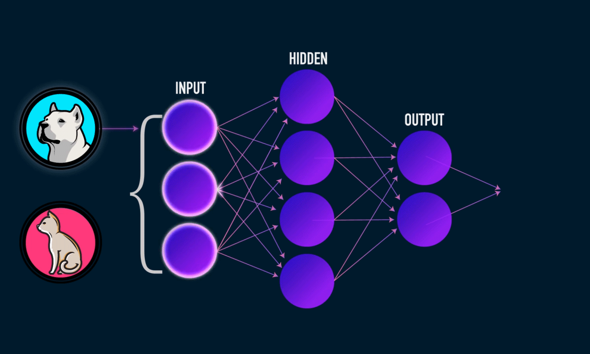

# REDES NEURONALES

##
Las redes neuronales artificiales son una representación abstracta del comportamiento de una red neuronal biológica. Su contexto se remonta a 1943, año en el cual McCulloch y Pitts proponen el primer modelo neuronal, dicho modelo era un modelo binario, en el cual cada neurona tenía un escalón o umbral prefijado. De esta manera sirvió de base para los modelos posteriores.

{width=600px}

## Capas

Las redes neuronales están compuestas por capas de neuronas que se comunican entre si y es posible dividirlas de la siguiente manera: 

- Capa de entrada
- Capa oculta
- Capa de salida

{width=300px}

# ADAPTACIÓN DE REDES NEURONALES

## Función base

## Función de activación

# ENTRENAMIENTO DE REDES NEURONALES

## 

# APLICACIONES

# EJEMPLO DE APLICACIÓN

